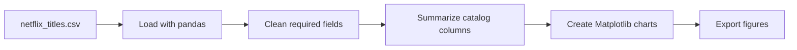

# Netflix Catalog Data Analysis and Visualization

A Jupyter notebook project exploring the Netflix titles catalog. The analysis cleans the catalog data and creates visual comparisons of Movies and TV Shows, release years, ratings, countries, and content distribution.

## Questions explored

- How does the catalog split between Movies and TV Shows?
- How has the volume of titles changed by release year?
- Which ratings and countries appear most frequently?
- What does the distribution of movie durations look like?

## Project structure

```text
.
├── Netflix_Data_Analysis_Visualization_Project.ipynb  # Main analysis
├── Matplotlib_notes.ipynb                             # Plotting practice notes
├── netflix_titles.csv                                 # Dataset used by the notebook
└── *.png                                              # Exported charts
```

## Analysis flow



The notebook uses pandas to load the CSV, removes rows missing selected fields used in the analysis, computes grouped counts and distributions, and plots the results with Matplotlib. Charts in the repository are saved outputs; rerun the notebook to regenerate them.

## Run the notebook

### Google Colab

1. Open `Netflix_Data_Analysis_Visualization_Project.ipynb` in Colab.
2. Upload `netflix_titles.csv` when prompted, or mount a Drive folder and update the data path.
3. Run the cells from top to bottom.

### Local Jupyter

Prerequisites: Python 3.9+.

```bash
git clone https://github.com/Prem7105/Netflix-Data-Visualization.git
cd Netflix-Data-Visualization
python -m venv .venv
# Windows PowerShell: .venv\Scripts\Activate.ps1
# macOS/Linux: source .venv/bin/activate
python -m pip install pandas matplotlib jupyter
jupyter notebook
```

Open the main notebook and run all cells. If you use a different catalog extract, place it at the expected path or update the `read_csv` cell.

## Data notes

The analysis describes the supplied catalog snapshot, not Netflix's current catalog. Counts and patterns depend on the dataset version and on rows removed during cleaning. The data is observational and does not explain why titles were added or removed. Confirm the dataset's source and reuse terms before redistribution.
